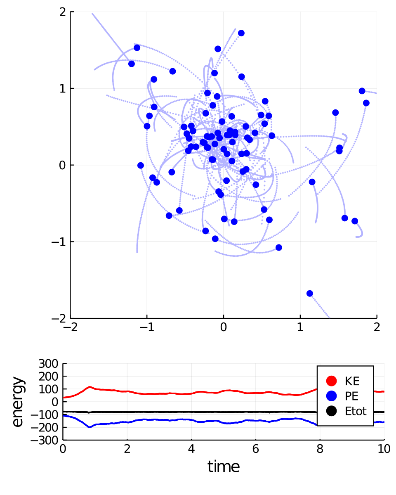

# nbody-julia
Vectorized N-body code (Julia)

## Create Your Own N-body Simulation (With Julia)

### Philip Mocz (2020) Princeton Univeristy, [@PMocz](https://twitter.com/PMocz)

Simulate orbits of stars interacting due to gravity

Code calculates pairwise forces according to Newton's Law of Gravity

```
julia nbody.jl
```


